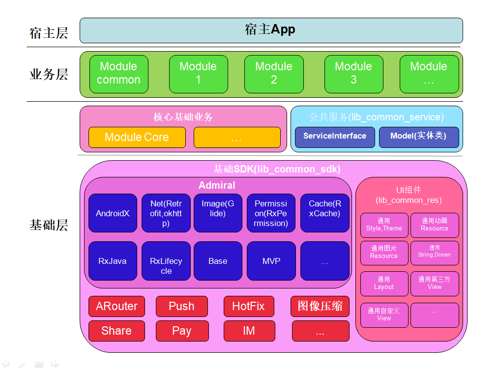

### Show some :heart: and star the repo to support the project

[](https://github.com/smarthane/AdmiralComponent) [](https://github.com/smarthane/AdmiralComponent/fork) [](https://github.com/smarthane/AdmiralComponent) [](https://github.com/smarthane/AdmiralComponent)  

# AdmiralComponent
:dart: 1. Admiral, 极简组件化快速开发框架（整合了Androidx+Rxjava2+Retrofit2+OkHttp3+ARouter+MVP+FlutterBoost等等主流开源项目,极易上手的组件化框架）。

:dart: 2. 本框架是参考jessyan大神的 [**MVPArms**](https://github.com/JessYanCoding/MVPArms) 和 [**ArmsComponent**](https://github.com/JessYanCoding/ArmsComponent)，保留原有框架的思想基础去掉了dagger2的依赖注入框架从而简化了开发上手难度，并且采用android官方最新的组件库androidx。

:dart: 3. 框架集成了闲鱼技术团队开源的 [**FlutterBoost**](https://github.com/alibaba/flutter_boost) ，可以非常简单方便的进行Native和Flutter的混合开发。详细可以参看 **【dev_hybrid_flutter】** 分支中的 **【module_wanandroid】** 和 **【module_flutter】** 模块。

:dart: 4. 框架集成了腾讯开源的 [**Tinker**](https://github.com/Tencent/tinker) ，可以非常简单方便的实现应用热修复能力。详细可以参看 **【dev_tinker】** 分支。

:dart: 5. 本框架的目标是 **【一切从简】**，让任何基础的安卓开发人员都能非常容易的上手MVP的组件化开发。所有的仪式什么的都免了，把繁琐的都换成最简单的、直接达成最终目的，所有东西所有过程都简单化回归安卓最原始的开发。

## :sparkles: Architectural
<p align="center">
  
</p>  

## :sparkles: Overview
<p align="center">
  
</p>  

## :sparkles: Wiki
* [**^_^ 参看ArmsComponent ^_^**](https://github.com/JessYanCoding/ArmsComponent/wiki)
* [**^_^ Flutter实战 ^_^**](https://book.flutterchina.club/)
* [**^_^ awesome-flutter ^_^**](https://github.com/Solido/awesome-flutter)
* [**^_^ Tinker ^_^**](https://github.com/Tencent/tinker)
* [**^_^ Bugly ^_^**](http://www.tinkerpatch.com/)
* [**^_^ TinkerPatch ^_^**](https://bugly.qq.com/v2/)

## :sparkles: Branches
* **【dev_native】**: 纯原生的Admiral开发框架。
* **【dev_tinker】**: 集成Tinker热修复开发框架。
* **【dev_hybrid_flutter】**: 集成Flutter进行混合开发框架。

## :sparkles: About Me

* **Name**: smarthane
* **Email**: <459121776@qq.com>
* **Description**: Android and J2EE developer

## :sparkles: License
```
 Copyright 2019, smarthane

   Licensed under the Apache License, Version 2.0 (the "License");
   you may not use this file except in compliance with the License.
   You may obtain a copy of the License at

       http://www.apache.org/licenses/LICENSE-2.0

   Unless required by applicable law or agreed to in writing, software
   distributed under the License is distributed on an "AS IS" BASIS,
   WITHOUT WARRANTIES OR CONDITIONS OF ANY KIND, either express or implied.
   See the License for the specific language governing permissions and
   limitations under the License.
```
